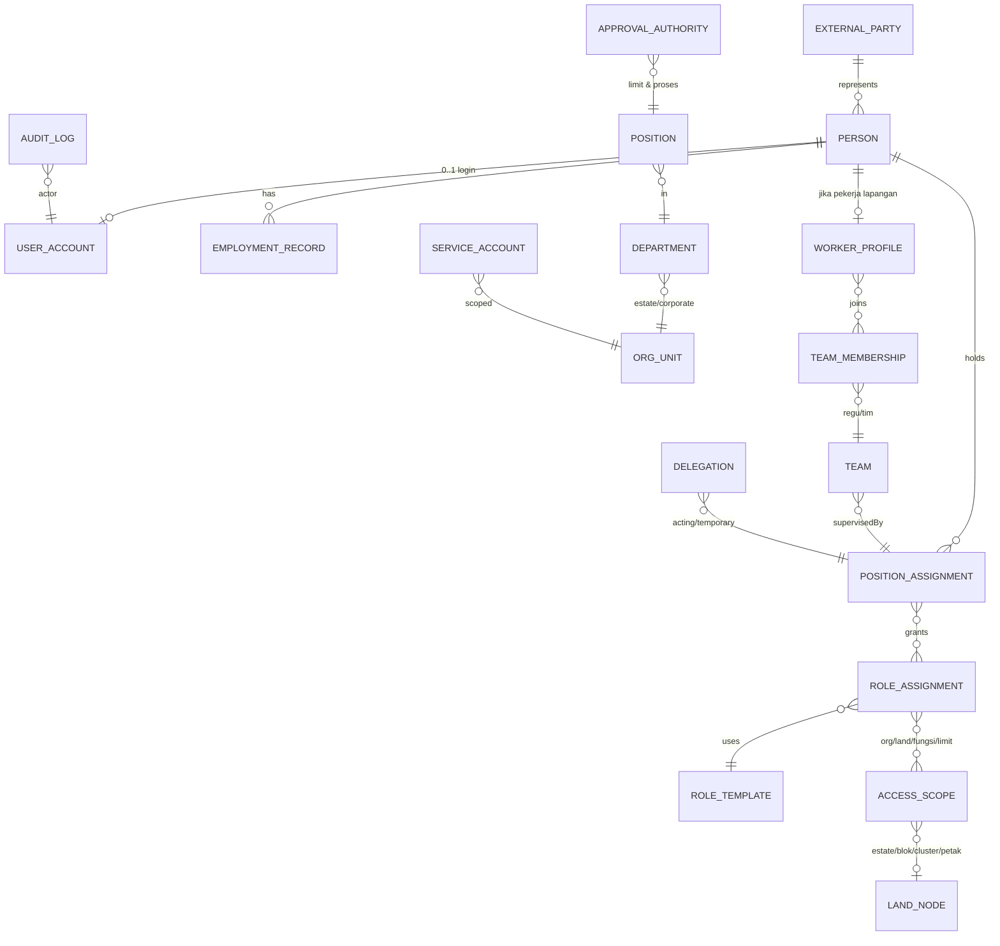

# Audit Struktur Organisasi & Akses — VarmOS Plantation

Tanggal: 24 Juli 2026 • Basis audit: `src/App.jsx` (kondisi hidup, supersedes `varmos-plantation_15.jsx`) • Status: **audit & rekomendasi — belum ada perubahan kode**

> Catatan basis: sejak `_15.jsx`, beberapa temuan yang diminta PDF sudah terlanjur diperbaiki di source hidup dan diperhitungkan dalam audit ini: (a) akun Field Supervisor sudah per-orang (Yudha/Saktian/Indra/Asep) dengan scope blok yang di-enforce (`scopeBlocks`/`inScope`), (b) modul Inventori sudah punya persetujuan kuorum formal (approvals[] berbasis user-ID, min 3 Direksi), (c) guard rute terpusat berbasis hide-list. Sisanya masih sesuai kondisi `_15`.

---

## 1. Executive Summary

**Apakah struktur saat ini cukup?** Untuk prototipe satu estate: ya, dan terbukti bisa menegakkan least-privilege sederhana (hide-list + `can()` + scope blok FS). Untuk organisasi nyata (apalagi multi-estate): **tidak** — modelnya satu-lapis: `role` tunggal per user, scope hanya `blocks[]`, dan hubungan antar-entitas banyak yang berbasis **nama string**, bukan ID.

**Masalah utama (diurutkan berdasarkan risiko):**
1. **Nama sebagai foreign key.** `wo.supervisor`, `LB_ASSIGN.mandor→lbFsName`, `FS_BY_BLOCK` (nama), `alert.ownerName`, `pack.data.workOrders.supervisor` — semuanya string nama. Ganti nama orang = putusnya jejak. `FS_USER_BY_BLOCK` (ID) baru ada untuk sebagian alur.
2. **Akun jabatan (shared account) merusak audit trail.** `Akun Estate Manager`, `Akun Agronomy Head`, `Akun Warehouse Officer`, `Akun Finance` masih akun posisi. Verifikasi WO, persetujuan rencana, dan penutupan alert oleh "Akun Estate Manager" tidak bisa dilacak ke individu.
3. **Role = jabatan = tim = scope dicampur dalam satu field.** "Estate Manager" sekaligus nama jabatan, role akses, level approval, dan (implisit) departemen. Tidak ada entitas Position/Team/Department.
4. **Dua dunia FS tidak tersambung by-ID.** FS hidup di 3 tempat: `INIT_USERS` (akun), `FS_BY_BLOCK`/`FS_USER_BY_BLOCK` (konstanta), `LB_FS` (workforce) — dijahit dengan nama. Regu/pekerja (`LB_WORKERS`) sama sekali tidak terhubung ke akun.
5. **Approval belum menjadi model.** Kecuali kuorum Direksi di Inventori (satu-satunya approval formal ber-ID), sisanya adalah gerbang role (`can(role,"verify")`) tanpa limit, tanpa delegasi, tanpa segregation-of-duties eksplisit (EM boleh membuat WO dan memverifikasinya sendiri).
6. **Multi-estate belum dimodelkan.** `ESTATE`/`EST-001` hard-coded, estate switcher dekoratif, seluruh land-ID (`GH-…`) menempel prefiks estate di string.

**Risiko bila struktur datar dipertahankan:** audit trail tidak sah secara tata kelola (satu akun banyak orang), kesulitan rotasi/mutasi personel (nama tersebar di data), tidak mungkin onboarding estate kedua tanpa fork kode, dan approval finansial tanpa batas kewenangan.

**Rekomendasi:** **Alternatif 2 — Functional Estate Model** sebagai target arsitektur, diimplementasikan bertahap dari fondasi Lean (Fase 1): pisahkan `Person / UserAccount / Position / RoleAssignment / Scope`, ganti semua rujukan nama → ID, formalkan approval matrix, dan modelkan workforce (regu/pekerja) sebagai record non-akun yang tersambung ke Person.

---

## 2. Current-State Model (dari source)

| Entitas | Lokasi di source | Atribut kunci | Fungsi | Hubungan | Keterbatasan |
|---|---|---|---|---|---|
| Role | `ROLES` (9 role) | `def`, `hide[]`, `desc` | Landing + sembunyikan halaman | dipakai `can()`, guard rute, sidebar | Role=jabatan=tim; page-level, bukan permission granular |
| Permission aksi | `can(role,act)`, `AL_PERMS`, `alertCanRolePerform` | daftar role per aksi | Gerbang verify/create/approve | hard-coded per aksi | Tersebar; tanpa limit nominal; tanpa delegasi |
| User | `INIT_USERS` (11 akun) | `{id,name,email,role,blocks[],status,twoFA,…}` | Autentikasi + scope | `curUser` di seluruh ctx | 1 user = 1 role; scope hanya blocks; 4 akun masih shared/posisi |
| Scope blok | `users.blocks[]` + `scopeBlocks()/inScope()` | array id blok | Hard-scope FS (WO/alert/labor/peta/dst.) | dipakai ±15 halaman | Hanya level blok; tak ada scope estate/komoditas/fungsi |
| FS (konstanta) | `FS_BY_BLOCK` (nama), `FS_USER_BY_BLOCK` (id) | blok→nama / blok→userId | Default supervisor/assignee | dipakai WO/alert/paket | Duplikasi dgn users & LB_FS; jahitan nama |
| FS (workforce) | `LB_FS` (FS-01…04) | id, block, name, phone | Mandor regu | `LB_GROUPS.fs`, `LB_ASSIGN.mandor` | ID `FS-xx` ≠ `USR-xxx`; tidak ada penghubung |
| Regu | `LB_GROUPS` (4, derived) | id REGU-B0x, block, fs, count, skill | Unit kerja per blok | 1 regu = 1 blok (kaku) | Tidak bisa lintas blok/dipindah; bukan entitas independen |
| Pekerja | `LB_WORKERS` (±40 TK-10xx) | block, group, mandor, type, skill, doc | Absensi, HOK, produktivitas | fingerprint `LB_ATTEND` | Tanpa Person/akun; Ketua Regu hanya `w.role` string |
| Penugasan | `LB_ASSIGN` | wo, block, group, mandor(FS-id), workers(n) | Roster harian | ke WO via kode string | jumlah pekerja agregat, bukan daftar ID |
| WO | `wos` | `supervisor` (nama), `assignedTo` implisit | Eksekusi pekerjaan | verifikasi via `can(role,"verify")` | Owner by-name; verifier tanpa SoD |
| Alert | `alerts` | `ownerId`+`ownerName`, `executorName`, verifier | Closed-loop | `alertCanRolePerform` | executor masih nama; owner bisa role generik |
| Approval formal | `invReqs` (baru) | `approvals[{id,name,at}]`, kuorum 3 Direksi | Pengadaan material | user-ID, anti-dobel | Satu-satunya; belum ada limit nominal |
| Organisasi | `ESTATE`, `BLOCKS`, `HS_GEO` | 1 estate hard-coded | Konteks lahan | land hierarchy solid | Tidak ada Company/Region/Department/Team/Position |

**Bentuk penyimpanan hubungan (penanda risiko):** ID ✅ hanya pada: users, alerts.ownerId, invReqs.approvals, FS_USER_BY_BLOCK, LB internal (group/mandor/worker). **Nama string ⚠** pada: wo.supervisor, alert.executorName/pic, SUPERVISORS[], evidence.capturedBy, pkg.fs, DECISIONS.pic. **Konstanta hard-coded ⚠** : FS_BY_BLOCK, FS_USER_BY_BLOCK, INV_CAN_REQUEST, daftar role dalam `can()`.

---

## 3. Current-State Gaps

- **Organization gaps:** tidak ada entitas Company/Region/Estate(≠konstanta)/Department/Team/Position/ReportingLine/CostCenter. Estate switcher hanya UI.
- **Role gaps:** role tunggal per user; role merangkap jabatan; tidak ada role per-estate, acting/delegated role, read-only tambahan; "Seedling Officer" kini role tanpa penghuni (bukti role≠orang sudah terasa).
- **Team gaps:** regu = derivasi blok, bukan tim; tidak ada tim fungsional (agronomi, gudang) atau tim proyek/panen lintas blok.
- **Workforce gaps:** pekerja tidak punya Person-ID yang sama dengan dunia akun; Ketua Regu tanpa representasi; pekerja borongan/vendor crew tidak dimodelkan; satu pekerja terkunci di satu regu/blok.
- **Scope gaps:** hanya blok. Tidak ada scope estate, nursery/gudang (Warehouse & Seedling justru bekerja pada lokasi non-blok), komoditas, fungsi, finansial (limit).
- **Approval gaps:** tanpa approval limit, tanpa delegasi/eskalasi, SoD tidak ditegakkan (pembuat WO = verifier dimungkinkan untuk EM/AH; Warehouse adjustment tanpa approval terpisah; perubahan akses disetujui diri sendiri oleh SA).
- **Auditability gaps:** 4 akun posisi (EM/AH/WH/Fin) → aksi tidak terlacak ke orang; `userLog` menyimpan teks bebas, bukan event terstruktur; banyak "by" di timeline berupa nama string.
- **Multi-estate gaps:** prefiks `GH-` di semua id lahan; TODAY/estate/weather/anchor tunggal; tidak ada user↔estate assignment.

---

## 4. Team Requirement Matrix

| Tim | Level | MVP | Growth | Enterprise | Rasional (modul terkait) |
|---|---|---|---|---|---|
| Direksi/Board | Corporate | ✅ | ✅ | ✅ | Sudah nyata: kuorum Inventori, Keputusan CC |
| Finance & Accounting | Corporate | ✅ (1 orang) | ✅ | ✅ | Budget, PO; sekarang role Finance |
| IT/System Admin | Corporate | ✅ (SA) | ✅ | ✅ | users, integrasi, DQ rules |
| Corporate Agronomy | Corporate | — | ✅ | ✅ | Review lintas estate (hs, rekomendasi AI) |
| HR & Workforce | Corporate | — | ✅ | ✅ | LB_WORKERS/payroll ref; kini dirangkap EM |
| Procurement | Corporate | — | ✅ | ✅ | invReqs→PO; kini Finance/EM |
| Internal Audit / ESG / Legal / Commercial | Corporate | — | — | ✅ | belum ada modulnya |
| Regional Ops/Agro/Fin | Regional | — | — | ✅ | hanya relevan multi-estate |
| Estate Management | Estate | ✅ | ✅ | ✅ | EM: CC, verifikasi, rencana |
| Agronomy (estate) | Estate | ✅ | ✅ | ✅ | health, surveilans, pemupukan, SOP, hs |
| Field Operations | Estate | ✅ | ✅ | ✅ | 4 FS + regu — sudah ada |
| Warehouse & Inventory | Estate | ✅ | ✅ | ✅ | inventori + pengajuan |
| Nursery & Planting | Estate | ✅ (posisi, boleh dirangkap) | ✅ | ✅ | planting/penyulaman; posisi sedang kosong |
| Irrigation & Water | Estate | — (dirangkap FS/EM) | ✅ | ✅ | Manajemen Air, pompa |
| Workforce/HOK Admin | Estate | — (dirangkap EM) | ✅ | ✅ | assign, HOK, tarif |
| Data & Digital Ops | Estate | — (dirangkap AH/SA) | ✅ | ✅ | DQ, hs-verification |
| Safety/Machinery/Harvest team | Estate/Field | — | ✅ | ✅ | modul panen masih dini |
| Regu HOK per blok + Ketua Regu | Field | ✅ (sudah ada) | ✅ | ✅ | LB_GROUPS |
| Tim spesialis (spray/sensus/drone) | Field | — | ✅ | ✅ | saat ini skill di regu |
| Landowner (Mitra) | External | ✅ (sudah ada) | ✅ | ✅ | PEAK 92, read-only |
| Vendor/Contractor/Auditor/Offtaker | External | — | ✅ | ✅ | belum ada modul |

---

## 5. Tiga Alternatif Struktur Organisasi

### Alternatif 1 — Lean Single-Estate
- **Hierarki:** Estate → Blok; tanpa Department; posisi = 8 jabatan inti.
- **Isi:** semua role sekarang dipertahankan, hanya: akun posisi → akun orang, semua nama → ID, `blocks[]` tetap sebagai scope.
- **Approval:** matrix statis per proses (tanpa limit nominal).
- **Kelebihan:** perubahan kecil, cepat, cocok demo. **Kekurangan:** tidak menjawab team/position/multi-estate; scope tetap blok-sentris. **Kompleksitas:** rendah. **Dipakai bila:** horizon produk ≤ 1 estate selama ≥ 1 tahun.
- **Dampak source:** rename akun, tabel penghubung kecil, refactor supervisor→userId.

### Alternatif 2 — Functional Estate Model ⭐ (direkomendasikan)
- **Hierarki:** Company → Estate → Department (Estate Mgmt, Agronomi, Field Ops, Gudang & Sarana, Admin & Workforce) → Team (regu, tim fungsional) → Position.
- **Isi:** entitas `Person`, `UserAccount(0..1 per Person)`, `Position` + `PositionAssignment`, `RoleTemplate` + `RoleAssignment(scope)`, `Team/TeamMembership`, `WorkerProfile` (non-akun). Approval matrix formal + SoD + limit dasar.
- **Kelebihan:** menjawab semua gap inti tanpa membawa beban Region/BU; workforce tersambung; siap tumbuh ke Alt-3 tanpa migrasi ulang (estateId sudah menjadi kolom scope). **Kekurangan:** perlu refactor state & halaman Manajemen Pengguna. **Kompleksitas:** menengah.
- **Dampak source:** normalisasi INIT_USERS → PERSONS+ACCOUNTS+ASSIGNMENTS; LB_FS/LB_GROUPS diberi personId/teamId; `can()` → roleTemplate+scope resolver (bisa bertahap, tetap kompatibel).

### Alternatif 3 — Multi-Estate Enterprise
- **Hierarki:** Company → BU → Region → Estate → Department → Team → Position; shared services; vendor org; service account; delegation & eskalasi penuh; integrasi ERP.
- **Kelebihan:** lengkap. **Kekurangan:** untuk kondisi 1 estate sekarang = overhead besar; banyak entitas tanpa modul pemakainya. **Kompleksitas:** tinggi. **Dipakai bila:** ≥ 3 estate/region nyata atau tuntutan korporat/ERP.
- **Dampak source:** semua dampak Alt-2 + estate switcher nyata + refactor prefiks land-ID.

**Pilihan:** Alt-2, dieksekusi bertahap (roadmap §17); desain data Alt-2 sengaja dibuat forward-compatible ke Alt-3 (kolom `estateId` ada sejak awal, Region/BU menyusul sebagai parent opsional).

---

## 6. Struktur Organisasi Direkomendasikan

```
Company: Elevarm / VarmOS
└── Estate: Gunung Hejo (EST-001)
    ├── Dept. Estate Management      — EM, Estate Administrator*
    ├── Dept. Agronomi               — Agronomy Head, Agronomist*, Crop Protection*
    ├── Dept. Field Operations       — Field Ops Head*(=EM MVP), FS Blok 1–4
    │   ├── Team: Regu HOK Blok 1 (Ketua Regu + anggota)
    │   ├── Team: Regu HOK Blok 2/3/4
    │   └── Team: Tim Spesialis* (spray/sensus/panen — Growth)
    ├── Dept. Gudang & Sarana        — Warehouse Officer, Irrigation Officer*
    ├── Dept. Nursery & Penanaman    — Nursery Officer (posisi kosong saat ini)
    └── Dept. Admin & Workforce      — Workforce Admin*(=EM MVP)
Corporate: Direksi (4) • Finance • System Admin • [Growth: Corp Agronomy, HR, Procurement]
External: Mitra Lahan (PEAK 92) • [Growth: Vendor/Kontraktor/Auditor]
* = posisi opsional/dirangkap pada MVP
```
Tiga hierarki dipisah tegas: **Organization** (di atas) ≠ **Land** (Estate→Blok→Cluster→Petak→Pohon — sudah sehat di `HS_GEO`) ≠ **Workforce** (FS→Regu→Ketua→Anggota — sudah ada di LB_*, tinggal dihubungkan by-ID). Scope akses = kombinasi (org-unit, land-node, fungsi, limit finansial) — bukan satu field `blocks`.

---

## 7. Position Catalog (ringkas)

| Position | Dept | Level | ReportsTo | Akun? | Approval | Scope | Status MVP |
|---|---|---|---|---|---|---|---|
| Director | Corporate | C | — | ✅ Approval-heavy | kuorum pengadaan, keputusan | company | Wajib (sudah, 4 orang) |
| Estate Manager | Estate Mgmt | L3 | Director | ✅ Full | verifikasi WO, rencana, HOK | estate | Wajib — **ganti akun orang** |
| Agronomy Head | Agronomi | L3 | EM (adm) / CorpAgro (fungsional, Growth) | ✅ Full | verifikasi agronomis, rekomendasi | estate | Wajib — **ganti akun orang** |
| Field Supervisor (×4) | Field Ops | L4 | EM | ✅ Mobile+desktop | ajukan selesai WO, absensi regu | blok penugasan | Wajib (sudah per-orang ✅) |
| Warehouse Officer | Gudang | L4 | EM | ✅ Full | pengajuan pengadaan | gudang estate | Wajib — **ganti akun orang** |
| Finance Officer | Corporate | L4 | Director | ✅ Full | pencatatan; approval biaya (limit, Growth) | company-finance | Wajib — **ganti akun orang** |
| System Administrator | Corporate IT | L4 | Director | ✅ Full | akses & master data | system | Wajib (jadikan personal + service acct terpisah) |
| Nursery Officer | Nursery | L4 | EM | ✅ | planting/penyulaman | nursery+blok | Opsional (posisi kosong — role template disimpan) |
| Ketua Regu | Field | L5 | FS | ❌ MVP → 📱 Limited (Growth) | konfirmasi kehadiran regu | regu | Workforce record dulu |
| Anggota HOK / Borongan / Musiman | Field | L6 | Ketua Regu | ❌ selamanya (workforce record) | — | — | Wajib sebagai record, bukan akun |
| Estate Administrator, Irrigation, Harvest, Workforce Admin, Cost Controller, DQ Officer, Integration Admin | var | L4–5 | var | nanti | var | var | Growth/Enterprise; MVP dirangkap |

**Tidak boleh menjadi role sistem tersendiri:** Ketua Regu, Anggota HOK, Assistant FS (cukup position+workforce); "Direksi" tetap role tapi kewenangannya dari ApprovalAuthority, bukan hide-list semata.

---

## 8. Role vs Position Matrix

Konsep: **Position** = jabatan (di org chart) • **RoleTemplate** = paket izin aplikasi • **Team** = unit kerja • **Scope** = data yang boleh disentuh. Satu assignment = (Person, Position, RoleTemplate[], Scope).

| Position | Role Template | Team | Org Scope | Land Scope | Izin tambahan |
|---|---|---|---|---|---|
| Estate Manager | `estate-operations-approver` | Estate Mgmt | EST-001 | seluruh estate | approve rencana, verifikasi WO |
| Agronomy Head | `agronomy-lead` | Agronomi | EST-001 | seluruh estate | verifikasi agronomis, SOP |
| FS Blok 1 (Yudha) | `field-supervisor` | Regu B01 | Field Ops | **Blok 1** | mode lapangan penuh |
| Direktur (Febi) | `executive-approver` + `viewer-all` | Direksi | company | semua (read) | suara kuorum pengadaan |
| Mitra (PEAK 92) | `landowner-viewer` | External | mitra-org | estate (read) | highlight finansial saja |
| Corporate Agronomist (Growth) | `agronomy-reviewer` (read+review) | Corp Agro | company | semua estate | tanpa eksekusi |

Mapping ini yang menggantikan `ROLES[role].hide` tunggal: hide-list menjadi *derivasi* dari role template + scope, bukan sumber kebenaran.

---

## 9. User Account Eligibility Matrix

| Persona | Tipe akun | Login | Device | Aksi utama | Scope data |
|---|---|---|---|---|---|
| Direksi (4) | Approval-heavy Full User | ✅ | desktop/HP | review, keputusan, kuorum | company read |
| Estate Manager | Full User | ✅ | desktop | CC, verifikasi, rencana | estate |
| Agronomy Head | Full User | ✅ | desktop | agronomi, verifikasi | estate |
| Field Supervisor | Mobile Field User (+desktop) | ✅ | HP (PWA offline) | WO, absensi, inspeksi, sensus | blok penugasan |
| Warehouse Officer | Full User | ✅ | desktop | stok, pengajuan | gudang |
| Finance | Full User | ✅ | desktop | anggaran, biaya | finansial |
| Ketua Regu | MVP: ❌ (workforce record) → Growth: Limited Mobile | 📱 | HP | konfirmasi kehadiran, cek tugas regu | regu |
| Anggota HOK / musiman / borongan | Workforce Record Only — **tidak pernah akun** | ❌ | — | — (fingerprint) | — |
| Mitra Lahan | External Read-Only | ✅ | desktop/HP | pantau, laporan | estate read |
| Vendor/Kontraktor (Growth) | External Limited, time-bound | ✅ | HP | paket kerja, bukti | kontrak |
| Auditor (Growth) | External Read-Only, time-bound | ✅ | desktop | bukti & audit trail | sesuai penugasan |
| Drone/IoT/SAP (Growth) | Service Account non-interaktif | 🔑 API | — | push data | per-integrasi (INT_* sudah menyiratkan ini) |

---

## 10. Workforce Relationship Model

```
Person (individu) ──0..1── UserAccount (login)
   │ 1..n
EmploymentRecord (HOK Reguler/Musiman/Borongan/Spesialis/Karyawan)
   │                       ┌── FS = Person dgn UserAccount + Position(FS) + WorkerProfile? tidak —
WorkerProfile (TK-10xx) ───┤   FS adalah EMPLOYEE dengan akun; ia BUKAN WorkerProfile
   │ n..1                  └── Ketua Regu = WorkerProfile + flag kepemimpinan tim (tanpa akun di MVP)
TeamMembership ── Team/Regu (REGU-B0x) ── supervisedBy → PositionAssignment(FS)
   │                                    └─ defaultLandScope → Blok (bisa dipindah sementara: assignment override)
LB_ASSIGN (roster) → daftar WorkerProfile-ID (bukan agregat) → LB_ATTEND (fingerprint, per worker)
```
Jawaban kunci: FS = user+employee (✅ sudah); Ketua Regu tidak butuh akun di MVP; anggota HOK tidak pernah butuh akun; pekerja boleh multi-skill & pindah regu via TeamMembership berjangka; regu tidak boleh dikunci hard-coded ke blok (jadikan `defaultBlock` + penugasan); vendor crew (Growth) = Team bertipe vendor di bawah kontrak.

---

## 11. Recommended Conceptual Data Model


Hubungan inti: Person 1→n EmploymentRecord; Person 0→1 UserAccount; Person n↔n Position (via PositionAssignment berjangka); Assignment n↔n RoleAssignment; RoleAssignment n↔n AccessScope.

---

## 12. Approval & RACI Matrix (proses utama)

| Proses | Initiator | Executor | Verifier | Approver | Eskalasi |
|---|---|---|---|---|---|
| WO creation | FS/AH/EM | — | — | auto (Terjadwal) / EM bila lintas blok | EM |
| WO verification | FS (ajukan) | regu | **EM atau AH — bukan pembuat WO yang sama** | — | Direksi bila > SLA |
| Rework | verifier | FS | verifier | — | EM |
| HOK & lembur | FS | pekerja | Workforce Admin/EM | EM | Direksi (anomali) |
| Material issue (keluar gudang) | FS/AH | WH | WH | EM bila > batas harian | — |
| Material adjustment (opname) | WH | WH | **EM (wajib, bukan WH sendiri)** | Finance | Direksi |
| Purchase request | WH/AH/EM | — | — | **kuorum ≥3 Direksi (sudah ✅)** + limit nominal (Growth) | — |
| Budget approval | Finance | — | EM | Direksi | — |
| Alert closure | owner | executor | verifier (AH/EM) | — | Direksi via eskalasi SLA (sudah ada rantainya) |
| Rekomendasi agronomis | sistem/AH | — | AH/EM (sudah) | — | — |
| Data issue resolution | DQ owner | assignee | AH/EM | — | SA |
| Master data & akses user | EM/SA | SA | — | **bukan pemilik akun yang diubah; perubahan akses SA butuh Direksi** | Direksi |

SoD minimum yang harus ditegakkan di kode: (1) `wo.createdBy != wo.verifiedBy`, (2) opname WH butuh approver non-WH, (3) perubahan akses tidak self-approve, (4) FS tidak menjadi verifier final pekerjaannya (sudah benar — FS tidak punya `verify`).

---

## 13. External User Model

- **Mitra Lahan:** entitas `ExternalParty(type=landowner)` + representative Person (PEAK 92 → person). Scope: estate read-only + highlight finansial (sudah sesuai keputusan produk). Tambahkan: akses laporan berkala.
- **Vendor/Kontraktor (Growth):** VendorOrg + kontrak + crew(Team tipe vendor) + work package; akun berjangka (expiry), sertifikat safety sebagai atribut compliance.
- **Konsultan/Auditor (Growth):** akun time-bound read-only, akses bukti & audit trail, tanpa unduh massal.
- **Integrasi (SAP/IoT/drone):** ServiceAccount non-interaktif dengan API-scope per estate + rotasi kredensial; `INT_*` (Integration Hub) adalah tempat alaminya — saat ini koneksi tercatat tanpa identitas akun.

---

## 14. Multi-Estate Model (arah)

`RoleAssignment` selalu membawa `estateId` (MVP: selalu EST-001). Dengan itu: user A bisa `EM@Gununghejo` sekaligus `Reviewer@Cimerak`; estate switcher menjadi filter assignment aktif; dashboard lintas estate = agregasi read atas scope gabungan; corporate role = assignment dengan scope company. Yang harus disiapkan sejak Fase 1 agar tidak migrasi dua kali: kolom `estateId` di semua entitas transaksi baru (WO/alert/plan sudah implisit GH — cukup biarkan; entitas baru wajib eksplisit).

---

## 15. UI/UX Recommendation

Halaman **Manajemen Pengguna** → menjadi hub "Orang & Akses" dengan tab (bukan menu baru):
- **Tab utama:** People (direktori person+workforce) • User Accounts • Teams & Regu • Roles & Access.
- **Drawer/detail:** profil person (identity/organization/access/employment/security terpisah seksi), team detail, access-scope editor.
- **Settings section (bukan menu):** Positions, Approval Authority, Service Accounts, Audit Log.
- **Kontekstual:** External users tab di dalam People (filter), bukan halaman sendiri.

```
┌ Orang & Akses ────────────────────────────────────────────┐
│ [People] [Akun] [Tim & Regu] [Role & Akses]   (+ Undang)  │
│ ┌───────────── People ─────────────────────────────────┐  │
│ │ ▸ Yudha Kubil    FS Blok 1   Akun ✓  Regu B01  Aktif │  │
│ │ ▸ TK-1004 Wawan  HOK Reguler Akun —  Regu B01  Aktif │  │
│ └──────────────────────────────────────────────────────┘  │
│ Drawer: [Identitas][Organisasi][Akses][Kepegawaian][Keamanan]│
│  Akses: Position FS Blok1 → role field-supervisor          │
│         Scope: EST-001 / Blok 1   [+ tambah assignment]    │
└───────────────────────────────────────────────────────────┘
```

---

## 16. Current-to-Future Mapping

| Field/Entitas sekarang | Target | Transformasi | Risiko |
|---|---|---|---|
| `INIT_USERS.role` | RoleAssignment(roleTemplate) | 1 role → 1 assignment default | rendah |
| `INIT_USERS.blocks` | AccessScope(land=blok[]) | pindah apa adanya | rendah |
| `INIT_USERS.notes` | Person.notes / Position label | parse manual | rendah |
| `ROLES.hide` | derivasi RoleTemplate.permissions | generator kompatibilitas dulu | sedang |
| `can(role,act)` | PermissionResolver(assignment,scope) | wrapper `can()` tetap ada | sedang |
| `FS_BY_BLOCK` / `FS_USER_BY_BLOCK` | query PositionAssignment(FS, blok) | hapus konstanta | sedang (banyak call-site) |
| `LB_FS` | Person+PositionAssignment | merge dgn users by nama → ID | sedang |
| `LB_GROUPS` | Team(tipe regu, defaultBlock) | tambah id stabil | rendah |
| `LB_WORKERS` | Person+WorkerProfile+TeamMembership | generate personId | rendah |
| `LB_ASSIGN.mandor` | assignment→PositionAssignment-ID | FS-xx → PA-id | rendah |
| `wo.supervisor` (nama) | `wo.supervisorId` (+nama denormal utk tampil) | backfill via FS map | **tinggi** (jejak lama) |
| `alert.ownerName/executorName` | ownerId (sudah ada) + executorId | backfill | sedang |
| Akun `Akun EM/AH/WH/Finance` | akun personal + arsip akun lama | buat person baru, nonaktifkan shared | **tinggi** (histori menunjuk akun lama — pertahankan sbg arsip, jangan hapus) |

---

## 17. Implementation Roadmap

**Fase 1 — MVP Organization Foundation** (paling berdampak, minim UI baru)
- Entity: Person, UserAccount, Position, RoleAssignment(estateId,blockScope), ReportingLine sederhana.
- Aksi kode: ganti 4 akun posisi → akun orang; semua `supervisor`/owner baru wajib ID; satukan FS_BY_BLOCK/LB_FS ke satu sumber.
- UI: drawer user dipecah seksi; kolom "Position".
- Acceptance: tidak ada aksi baru yang tercatat atas akun bersama; semua WO/alert baru menyimpan ID pelaku.
- Risiko: call-site supervisor-by-name; mitigasi: helper `supName(id)`.

**Fase 2 — Team & Workforce Integration**: Team/Regu sebagai entitas + TeamMembership + WorkerProfile↔Person; roster per-worker-ID; Ketua Regu flag. UI: tab Tim & Regu.

**Fase 3 — Approval & Delegation**: ApprovalAuthority (proses+limit), SoD enforcement (§12), Delegation/acting, eskalasi. UI: settings Approval Authority; badge "menunggu approval Anda".

**Fase 4 — Enterprise Multi-Estate**: Estate entitas nyata + switcher fungsional, Region/BU opsional, external users & service accounts, cross-estate dashboard.

---

## 18. Acceptance Criteria (dapat diuji)

1. Setiap aksi tulis (WO, verifikasi, approval, opname) menyimpan `actorUserId` — tidak ada lagi pencatatan atas "Akun <posisi>".
2. Mengganti nama seorang FS tidak memutus satu pun relasi (semua join via ID).
3. Satu Person dapat memegang ≥2 RoleAssignment dengan scope berbeda dan UI mengikutinya.
4. Pekerja HOK tampil di direktori People tanpa memiliki akun login.
5. `wo.createdBy === wo.verifiedBy` ditolak sistem.
6. Menonaktifkan akun tidak menghapus WorkerProfile/histori kehadiran orang tersebut.
7. Menambahkan estate kedua tidak memerlukan perubahan skema (hanya data).
8. Kuorum pengadaan tetap 3 Direksi dan tercatat per user-ID (regresi dari fitur yang sudah ada).

---

## 19. Open Product Decisions — ✅ DIPUTUSKAN (pemilik produk, 24 Jul 2026)

1. **Akun posisi → akun orang** — nama personel ditetapkan:
   - Estate Manager: **Dimas Fadhillah Hakim**
   - Agronomy Head: **Michelle Aisyah**
   - Warehouse Officer: **Mahfud Irsyad**
   - Finance: **Catherine**
2. **Ketua Regu mendapat akun mobile terbatas** (disetujui; membutuhkan Fase 2 — keterhubungan WorkerProfile↔Person).
3. **Tanpa limit nominal untuk saat ini** — semua pengeluaran tetap kuorum 3 Direksi. Ke depan diatur lewat **fitur pengaturan approval di modul Pengaturan** (ApprovalAuthority configurable — masuk backlog Fase 3, dimajukan sebagai fitur khusus).
4. **SoD dikunci di sistem**: pembuat WO tidak boleh memverifikasi WO-nya sendiri.
5. **Mitra Lahan mendapat unduhan laporan berkala**: Bulanan, Kuartalan, Semesteran, Tahunan. Selain Bulanan, laporan diperkaya *commentary*, analisis, dan rekomendasi.
6. Fase 1: menunggu penjelasan urgensi & dampak sebelum eksekusi (lihat ringkasan terpisah yang disampaikan ke pemilik produk).

**Urutan eksekusi turunan keputusan:** Fase 1 (fondasi ID & akun personal) → SoD verifikasi WO (butuh actor-ID) → fitur Pengaturan Approval → laporan berkala Mitra (independen, bisa paralel) → akun mobile Ketua Regu (setelah Fase 2).
